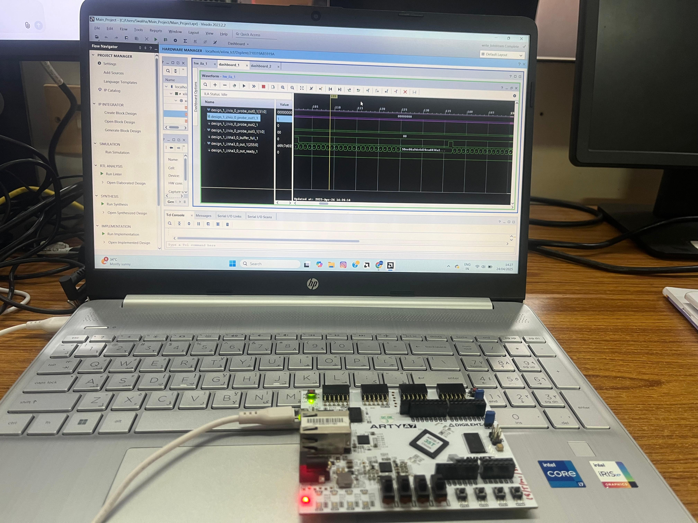
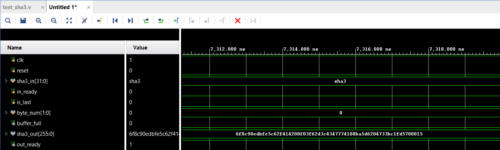
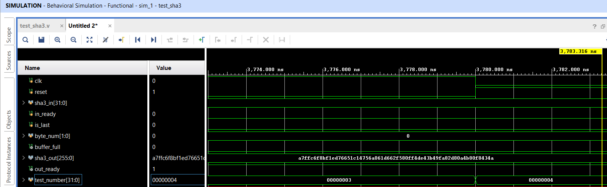
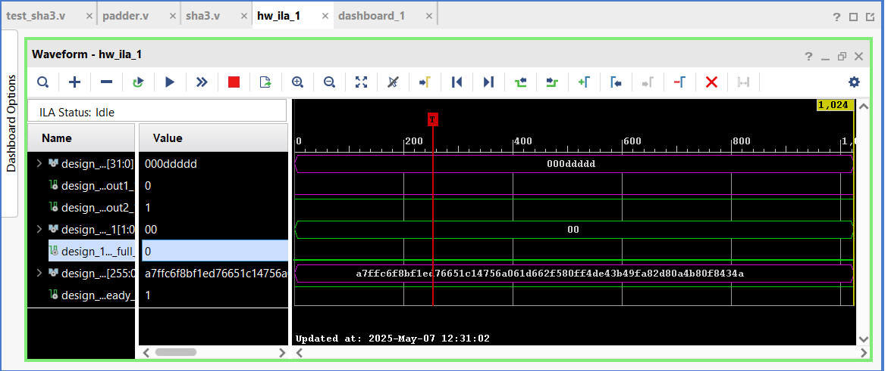
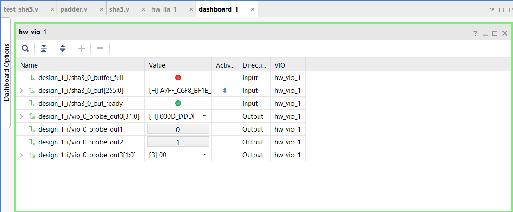
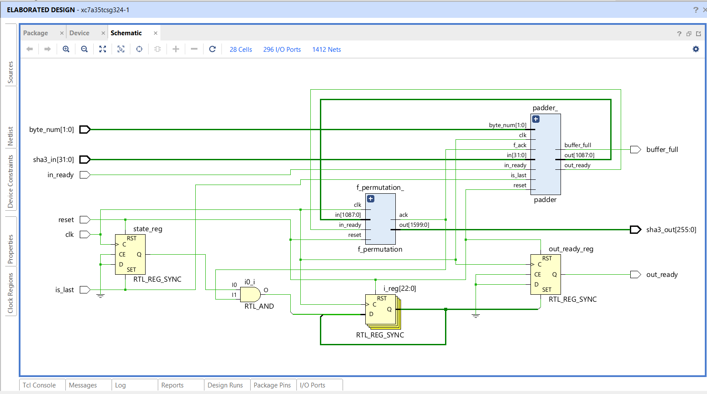
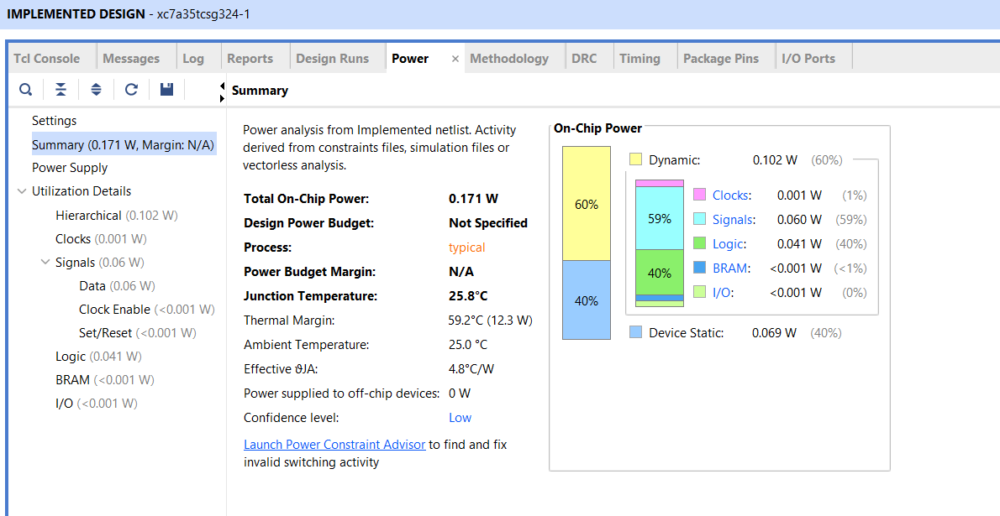
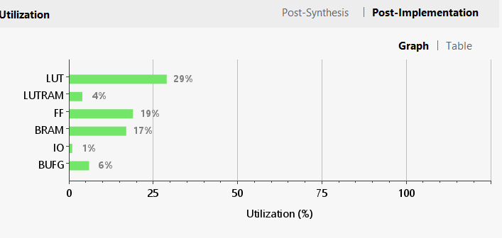
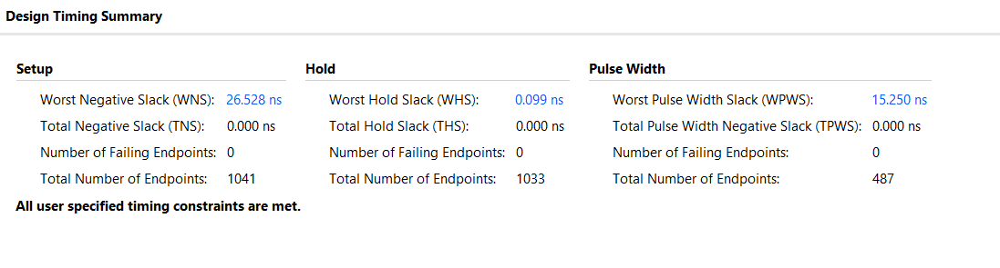

# SHA3-256 Cryptographic Hash IP Core on FPGA

A FIPS 202-compliant SHA3-256 hash core implemented in Verilog HDL, targeting a low-power, area-efficient design for embedded and IoT applications. Designed, simulated, synthesised, and validated on hardware.

> **Academic Project:** M.Tech in Electronic Design Technology, NIELIT Calicut
> **Year:** 2025

---

## Recruiter Snapshot

This project demonstrates practical experience with:

- RTL design in Verilog HDL
- Cryptographic hardware (Keccak / SHA-3 sponge construction)
- FPGA synthesis, implementation, and timing/power analysis (Xilinx Vivado)
- On-chip hardware debugging with ILA and VIO
- Functional verification against known test vectors
- Resource, power, and throughput trade-off analysis

**Technologies:** `Verilog HDL` `FPGA` `Xilinx Vivado` `RTL Design` `ILA/VIO` `Cryptography`

---

## Project Overview

The objective was to design a fully functional SHA3-256 hash function compliant with the FIPS 202 standard, optimised for minimal hardware resource utilisation and low power consumption — suitable for resource-constrained embedded and IoT systems — and to validate its correctness and efficiency through simulation and hardware testing.

SHA-3 is based on the Keccak algorithm's sponge construction, processing input through an absorbing phase and producing output through a squeezing phase, using a 1600-bit internal state arranged as a 5×5 matrix of 64-bit lanes.

## Architecture

This design uses a **sequential (non-unrolled) architecture**: rather than duplicating hardware for all 24 permutation rounds, a single functional unit is reused round-by-round. This deliberately trades throughput for significantly lower logic area and power consumption — a better fit for lightweight, embedded cryptographic applications than high-throughput, fully-pipelined designs.

Each round executes the five Keccak permutation steps in sequence:

1. **Theta (θ)** — column-parity XOR for inter-column diffusion
2. **Rho (ρ)** — bitwise lane rotation
3. **Pi (π)** — lane permutation
4. **Chi (χ)** — nonlinear XOR/AND transformation
5. **Iota (ι)** — round-constant injection to break symmetry

A Padder module handles input alignment, a MUX selects between new input and internal state feedback across rounds, and a round-count FSM drives the 24-round sequence before the final 256-bit hash is read out.

```
Input (32-bit) → Padder → Buffer/MUX → Keccak Permutation (24 rounds:
                                         Theta → Rho → Pi → Chi → Iota)
                                       → 256-bit SHA3-256 Output
```

## Interface / Pin Description

| Pin | Width | Description |
|---|---|---|
| `clk` | 1 | System clock |
| `reset` | 1 | Asynchronous reset |
| `sha3_in` | 32 | Input data to be hashed |
| `in_ready` | 1 | Input data ready |
| `is_last` | 1 | Marks the last input block |
| `byte_num` | 2 | Number of valid bytes in the current word |
| `buffer_full` | 1 | Internal buffer full flag |
| `sha3_out` | 256 | Output hash value |
| `out_ready` | 1 | Output hash ready |

## Hardware & Tools

- **FPGA board:** Arty A7 (Xilinx Artix-7, XC7A35TCSG324-1) — 33,280 logic cells, 90 DSP slices, 1,800 Kb block RAM
- **Design tool:** Xilinx Vivado Design Suite (2023.1 / 2023.2)
- **Debug tools:** Integrated Logic Analyzer (ILA), Virtual Input/Output (VIO)

## Verification

The design was functionally verified in simulation against known SHA3-256 test vectors, then validated on hardware:

| Input | Expected SHA3-256 Output |
|---|---|
| `"sha3"` | `6f8c90edbfe5c62f414208f03f62d3c4347774108ba5d6204733bc1fd5700015` |
| `""` (empty string) | `a7ffc6f8bf1ed76651c14756a061d662f580ff4de43b49fa82d80a4b80f8434a` |
| Longer multi-word string | Verified — confirms correct handling of variable-length input |

On hardware, output values read back through VIO were compared against precomputed reference hashes to confirm correctness — not just simulated behaviour.

## Results

| Metric | Value |
|---|---|
| Power consumption (total on-chip) | 171 mW (60% dynamic / 40% static) |
| Max operating frequency | 154.5 MHz |
| Throughput | ~1.6 Gbps |
| Energy per hash | 12.4 nJ |
| Energy per bit | 0.0484 nJ/bit |

### Post-Implementation Resource Utilization

| Resource | Utilization |
|---|---|
| LUT | 29% (6,038 used) |
| LUTRAM | 4% |
| FF (flip-flops) | 19% (7,697 used) |
| BRAM | 17% |
| IO | 1% |
| BUFG | 6% |

### Comparison with Prior Published Work

| | This project | Prior work [Ambaprasad et al., 2024] | Prior work [Dolmeta et al., 2023] |
|---|---|---|---|
| LUTs | **6,038** | 8,271 | 9,651 |
| Flip-Flops | **7,697** | — | 8,697 |

This design achieves lower LUT and flip-flop utilisation than both comparable published SHA-3 FPGA implementations, while meeting full FIPS 202 functional correctness.

## Demo / Evidence

**Hardware setup — Arty A7 running the design, live ILA capture on-screen:**



**Simulation — functional verification against test vectors:**


*Simulation waveform for input `"sha3"` — output hash matches the expected test vector.*


*Simulation waveform for an empty-string input — confirms correct edge-case handling.*

**On-chip debugging — ILA and VIO, empty-string input, captured directly from hardware:**


*ILA waveform read back from the FPGA, matching the simulated result.*


*VIO dashboard showing the live output hash and status signals on hardware.*

**Design & implementation reports:**


*Elaborated RTL schematic — padder, Keccak permutation core, and I/O registers.*


*Vivado power report: 0.171 W total on-chip power.*


*Post-implementation utilization: 29% LUT, 19% FF, on the Arty A7.*


*Vivado timing summary: worst negative slack of 26.528 ns against a 33 ns constraint, confirming the 154.5 MHz max frequency with zero failing endpoints.*

## Repository Structure

```
sha3_ip/
├── README.md
├── src/
│   ├── sha3.v
│   ├── f_permutation.v
│   ├── round.v
│   ├── rconst.v
│   ├── padder.v
│   └── padder1.v
├── sim/
│   ├── test_sha3.v
│   ├── test_f_permutation.v
│   ├── test_padder.v
│   ├── test_padder1.v
│   └── test_rconst.v
├── constraints/
│   └── sha3.xdc
└── sha3_ip_images/
    ├── hardware-setup.jpg
    ├── simulation-sha3-string.png
    ├── simulation-empty-string.png
    ├── ila-empty-string.png
    ├── vio-empty-string.png
    ├── rtl-schematic.png
    ├── power-report.png
    ├── resource-utilization.png
    └── timing_report.png
```

## Engineering Notes

- This is a **sequential, area/power-optimised** design, not a high-throughput one — that trade-off is intentional and documented, not a limitation to hide.
- **RISC-V integration is future scope, not implemented in this core.** The current design exposes a standalone streaming interface (see Interface table above); custom RISC-V instruction integration, ML-adaptive cryptographic protection, and post-quantum extensions are identified as next steps, not completed work.

## Future Scope

- SHA-3 acceleration via custom RISC-V instructions
- Integration with ML-based adaptive cryptographic protection
- Post-quantum-resistant primitive extensions

## Author

**Swaliha K A** 
[LinkedIn](https://www.linkedin.com/in/swaliha-ka) · [GitHub](https://github.com/Swaliha-k-a) · swaliha12316@gmail.com
## Suggested GitHub Topics

`fpga` `verilog` `sha3` `keccak` `cryptography` `rtl-design` `xilinx-vivado` `hardware-security` `hdl`
